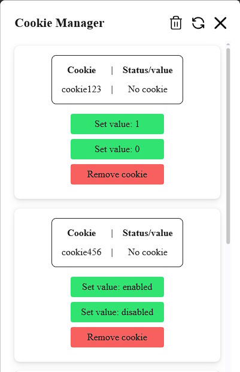

# Cookie Manager

Customizable Cookie Manager, where you can put just the cookies that you usually modify (e.g. for development purposes).  
Cookie Manager can be used as a Bookmarklet (browser bookmark that executes JavaScript code) so you can quickly run it in any browser.

## Quick start

To use Cookie Manager, simply:

1. Open the [bookmarklet.js](build/bookmarklet.js) file.
2. Copy the entire code (there is an option on GitHub: "copy raw contents").
3. Create a new bookmark in your browser and paste the code as an URL.
4. Use the bookmark.

## Features

- Only you decide what cookies and their values will be handled by Cookie Manager (check the [Development section](#development)).
- Correctly matches developer cookies with cookies in the browser and displays the status in real-time - either providing the value or indicating that the cookie does not exist in the browser.
- Opening and closing the Cookie Manager without refreshing the page.
- Refreshing the page using a button.
- Deleting all cookies managed by Cookie Manager with one click.
- Only one instance of Cookie Manager can be opened at a time.
- Dark overlay covering the page as long as Cookie Manager is open.
- Desktop and mobile view.
- Hovering over the "Cookie Manager" name shows the app version.
- Hovering over the header buttons will display a description of what they do.
- Hovering over the cookie name shows what the cookie does (if a description exists).

## Development

- Works with Node `22.12.0`
- `npm i`
- `npm run dev`
- Vite will launch, allowing you to see changes live. After closing Cookie Manager, refresh the page to make it appear again.
- The entire mechanism is based on the [devCookiesList](src/utils/devCookies.ts) variable, which you modify as needed. The content of Cookie Manager is generated based on that file.
- The styles (.scss partials) for different parts of Cookie Manager are located inside the components folders. All of them are imported into the main [styles.module.scss](src/styles/styles.module.scss) file, which is compiled into a .css file and imported in [app.ts](src/app.ts).
- I used as little styling as possible so Cookie Manager should, for example, use the fonts used on a site where you ran the app. If there are any inconsistencies or something is not right, you can update the styles to meet your expectations.
- Update the app version in `package.json`. This will be reflected in the app's header (on hover).
- Use `npm run build` to check the code with TypeScript and ESLint and generate the [bookmarklet.js](dist/bookmarklet.js) file with minified code. The `javascript:` string at the beginning is added automatically.
- The project should be type-safe so the bookmarklet will not be generated if there are any TS errors, unless you explicitly use `//@ts-nocheck` in a .ts file.
- Now you have developed your customized version of Cookie Manager and you can use it as described in the [Quick Start](#quick-start) section.

## Final Notes

- The first version of this project was released on the 14th of October 2022.
- The Cookie Manager JS/TS code is an IIFE function, which allows it to be executed multiple times without reloading the page. If it was a regular function + its call, using it a second time would result in an error that we are trying to re-declare the function.
- If Cookie Manager doesn't appear on the page, and subsequent clicks indicate it's already running, check if page elements don't have higher `z-indexes` than Cookie Manager. In this case they may simply cover the app and you should adjust the styles.
- I tried using emotion (CSS-in-JS) here but it generated too much boilerplate, so I stuck with plain Sass to include as little code in the bookmarklet as possible while being able to split styles for code organization purposes.